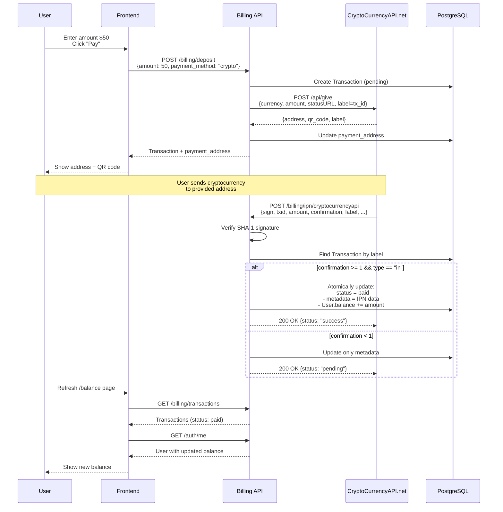

# CryptoCurrencyAPI IPN Integration Documentation

## Table of Contents
1. [Overview](#overview)
2. [Architecture](#architecture)
3. [Deposit Creation Flow](#deposit-creation-flow)
4. [IPN Endpoint](#ipn-endpoint)
5. [IPN Payload Format](#ipn-payload-format)
6. [Signature Verification Algorithm](#signature-verification-algorithm)
7. [Transaction Processing Logic](#transaction-processing-logic)
8. [Configuration](#configuration)
9. [Testing](#testing)
10. [Security Best Practices](#security-best-practices)
11. [Error Handling](#error-handling)
12. [Monitoring and Debugging](#monitoring-and-debugging)
13. [Troubleshooting](#troubleshooting)
14. [API Reference](#api-reference)
15. [Changelog](#changelog)

---

## Overview

This document describes the integration between our SSN Management System and [cryptocurrencyapi.net](https://new.cryptocurrencyapi.net/) for cryptocurrency payment processing.

### Supported Cryptocurrencies

- **USDT** (Tether) - TRC20, ERC20
- **BTC** (Bitcoin)
- **LTC** (Litecoin)
- **XMR** (Monero)
- And more (check cryptocurrencyapi.net documentation)

### Payment Flow

1. User creates deposit request → Transaction created in `pending` status
2. System calls cryptocurrencyapi.net API → Receives unique payment address
3. User sends cryptocurrency to provided address
4. cryptocurrencyapi.net monitors blockchain → Sends IPN when transaction is confirmed
5. Our IPN endpoint processes payment → Updates transaction status to `paid` and credits user balance

---

## Architecture



### Key Components

1. **Billing API** (`api/public/routers/billing.py`)
   - `/deposit` - Creates transaction and payment address
   - `/ipn/cryptocurrencyapi` - Receives payment notifications
   - `/transactions` - Lists user transactions

2. **CryptoCurrency Client** (`api/common/cryptocurrencyapi_client.py`)
   - `create_payment_address()` - Calls `give` API
   - `track_address()` - Calls `track` API

3. **Database Models** (`api/common/models_postgres.py`)
   - `Transaction` - Stores payment transactions
   - `User` - Contains user balance

---

## Deposit Creation Flow

### Endpoint: POST /api/public/billing/deposit

Creates a new deposit transaction and generates a unique payment address.

**Request:**
```json
{
  "amount": 50.00,
  "payment_method": "crypto"
}
```

**Response:**
```json
{
  "id": "3cce59d2-fc8e-4405-a21c-1d56d7f08e90",
  "amount": 50.00,
  "payment_method": "crypto",
  "status": "pending",
  "payment_provider": "cryptocurrencyapi",
  "payment_address": "TXYZabc123...",
  "metadata": {
    "qr_code": "https://api.qrserver.com/v1/create-qr-code/?data=TXYZabc123..."
  },
  "created_at": "2025-10-30T15:30:00Z",
  "updated_at": "2025-10-30T15:30:00Z"
}
```

### Process Steps

1. **Validation**
   - Amount must be between $5.00 and $5,000.00
   - Payment method must be valid enum value

2. **Transaction Creation**
   - Create `Transaction` record in `pending` status
   - Set `payment_provider` to "cryptocurrencyapi"

3. **Payment Address Generation**
   - Call cryptocurrencyapi.net `give` API:
     ```python
     {
       "key": API_KEY,
       "currency": "USDT",
       "amount": "50.00",
       "label": "3cce59d2-fc8e-4405-a21c-1d56d7f08e90",
       "statusURL": "https://yourdomain.com/api/public/billing/ipn/cryptocurrencyapi"
     }
     ```
   - Receive payment address and QR code
   - Update transaction with `payment_address` and `metadata`

4. **Response**
   - Return full transaction details including payment address

---

## IPN Endpoint

### URL: POST /api/public/billing/ipn/cryptocurrencyapi

**PUBLIC ENDPOINT** - No JWT authentication required (designed for webhooks).

### Request Headers
```
Content-Type: application/json
```

### Always Returns 200 OK

As required by cryptocurrencyapi.net, this endpoint **always** returns HTTP 200 OK, even on errors. The actual status is in the JSON response body.

---

## IPN Payload Format

### Complete Field List

| Field | Type | Description | Example |
|-------|------|-------------|---------|
| `cryptocurrencyapi.net` | int | API version (always 3) | `3` |
| `chain` | string | Blockchain network | `"tron"`, `"bitcoin"`, `"ethereum"` |
| `currency` | string | Native currency | `"TRX"`, `"BTC"`, `"ETH"` |
| `type` | string | Transaction direction | `"in"` (incoming), `"out"` (outgoing) |
| `date` | int | Unix timestamp | `1698765432` |
| `from` | string | Sender address (may be empty) | `"TFromAddress123..."` |
| `to` | string | Recipient address | `"TToAddress456..."` |
| `token` | string | Token symbol (for tokens) | `"USDT"`, `"USDC"` |
| `tokenContract` | string | Token contract address | `"TR7NHqjeKQxGTCi8q8ZY4pL8otSzgjLj6t"` |
| `amount` | string | Transaction amount (decimal) | `"50.00"` |
| `fee` | string | Transaction fee | `"0.0001"` |
| `txid` | string | Transaction hash | `"abc123def456..."` |
| `pos` | string | Output index (optional) | `"0"` |
| `confirmation` | int | Number of confirmations | `0`, `1`, `2`, ... |
| `label` | string | Transaction label (our tx ID) | `"3cce59d2-fc8e-4405-a21c-1d56d7f08e90"` |
| `sign` | string | SHA-1 signature (40 hex chars) | `"a1b2c3d4e5f6..."` |

### Example IPN Payload

```json
{
  "cryptocurrencyapi.net": 3,
  "chain": "tron",
  "currency": "TRX",
  "type": "in",
  "date": 1698765432,
  "from": "TFromAddress123...",
  "to": "TToAddress456...",
  "token": "USDT",
  "tokenContract": "TR7NHqjeKQxGTCi8q8ZY4pL8otSzgjLj6t",
  "amount": "50.00",
  "fee": "0.0001",
  "txid": "abc123def456...",
  "pos": null,
  "confirmation": 1,
  "label": "3cce59d2-fc8e-4405-a21c-1d56d7f08e90",
  "sign": "a1b2c3d4e5f6..."
}
```

---

## Signature Verification Algorithm

### CRITICAL: SHA-1 (Not HMAC!)

cryptocurrencyapi.net uses **SHA-1 hash** (NOT HMAC) for signature verification.

### Algorithm Steps

1. **Create payload copy** and remove `sign` field
2. **Sort keys** lexicographically (ASCII order)
3. **Form string**: `key1=value1&key2=value2&...`
4. **Append API key** to the end (without `&` separator)
5. **Calculate SHA-1** hash: `hashlib.sha1(string.encode()).hexdigest()`
6. **Compare** with provided signature using `secrets.compare_digest()`

### Python Implementation

```python
import hashlib
import secrets

def verify_cryptocurrencyapi_signature(payload: dict, signature: str, api_key: str) -> bool:
    # Step 1: Remove sign field
    payload_copy = {k: v for k, v in payload.items() if k != "sign"}

    # Step 2: Sort keys
    sorted_keys = sorted(payload_copy.keys())

    # Step 3: Form string
    parts = [f"{key}={payload_copy[key]}" for key in sorted_keys]
    message = "&".join(parts)

    # Step 4: Append API key
    message += api_key

    # Step 5: Calculate SHA-1
    computed_signature = hashlib.sha1(message.encode()).hexdigest()

    # Step 6: Constant-time comparison
    return secrets.compare_digest(computed_signature, signature)
```

### Node.js Implementation

```javascript
const crypto = require('crypto');
const { timingSafeEqual } = require('crypto');

function verifyCryptoCurrencyAPISignature(payload, signature, apiKey) {
    // Step 1: Remove sign field
    const payloadCopy = { ...payload };
    delete payloadCopy.sign;

    // Step 2: Sort keys
    const sortedKeys = Object.keys(payloadCopy).sort();

    // Step 3: Form string
    const parts = sortedKeys.map(key => `${key}=${payloadCopy[key]}`);
    let message = parts.join('&');

    // Step 4: Append API key
    message += apiKey;

    // Step 5: Calculate SHA-1
    const computedSignature = crypto
        .createHash('sha1')
        .update(message)
        .digest('hex');

    // Step 6: Constant-time comparison
    return timingSafeEqual(
        Buffer.from(computedSignature),
        Buffer.from(signature)
    );
}
```

### PHP Implementation

```php
function verify_cryptocurrencyapi_signature($payload, $signature, $api_key) {
    // Step 1: Remove sign field
    $payload_copy = $payload;
    unset($payload_copy['sign']);

    // Step 2: Sort keys
    ksort($payload_copy);

    // Step 3: Form string
    $parts = [];
    foreach ($payload_copy as $key => $value) {
        $parts[] = "$key=$value";
    }
    $message = implode('&', $parts);

    // Step 4: Append API key
    $message .= $api_key;

    // Step 5: Calculate SHA-1
    $computed_signature = sha1($message);

    // Step 6: Constant-time comparison
    return hash_equals($computed_signature, $signature);
}
```

### Common Mistakes

❌ **Wrong**: Using HMAC instead of SHA-1
```python
# This is WRONG
signature = hmac.new(api_key.encode(), message.encode(), hashlib.sha1).hexdigest()
```

✅ **Correct**: Simple SHA-1 hash
```python
# This is CORRECT
signature = hashlib.sha1(message.encode()).hexdigest()
```

❌ **Wrong**: Including `&` before API key
```python
message = "&".join(parts) + "&" + api_key  # WRONG
```

✅ **Correct**: No separator before API key
```python
message = "&".join(parts) + api_key  # CORRECT
```

---

## Transaction Processing Logic

### IPN Processing Flow

```python
# 1. Verify signature
if not verify_signature(payload, signature, api_key):
    return {"status": "error", "message": "Invalid signature"}

# 2. Parse payload
ipn_payload = CryptoCurrencyAPIIPNPayload(**payload)

# 3. Find transaction by label
transaction_id = UUID(ipn_payload.label)
transaction = db.query(Transaction).get(transaction_id)

# 4. Check idempotency
if transaction.status == "paid" and transaction.external_transaction_id == ipn_payload.txid:
    return {"status": "success", "message": "Already processed"}

# 5. Always update metadata
transaction.metadata = payload

# 6. Process payment if conditions met
if (ipn_payload.confirmation >= 1 and
    ipn_payload.type == "in" and
    transaction.status == "pending"):

    # Atomically update transaction and balance
    transaction.status = "paid"
    transaction.external_transaction_id = ipn_payload.txid

    # Atomic balance update with row lock
    db.execute(
        update(User)
        .where(User.id == transaction.user_id)
        .values(balance=User.balance + transaction.amount)
    )

    db.commit()
    return {"status": "success", "message": "Payment processed"}
```

### Confirmation Levels

| Confirmations | Action | Description |
|--------------|--------|-------------|
| 0 | Update metadata only | Transaction seen but not confirmed |
| 1+ | Process payment | Transaction confirmed, update balance |

### Transaction Types

- **`"in"`** - Incoming payment (credit user)
- **`"out"`** - Outgoing payment (ignore for deposits)

### Idempotency

The system handles duplicate IPNs gracefully:

1. Check if transaction already paid with same `txid`
2. If yes, return success without processing again
3. This prevents double-crediting user balance

### Atomic Balance Update

Uses PostgreSQL atomic update to prevent race conditions:

```sql
UPDATE users
SET balance = balance + :amount
WHERE id = :user_id
RETURNING balance;
```

This ensures:
- ✅ No lost updates from concurrent transactions
- ✅ Balance always consistent
- ✅ No overfunding or underfunding

---

## Configuration

### Environment Variables

Add to `.env` file:

```bash
# CryptoCurrencyAPI API key
CRYPTOCURRENCYAPI_KEY=your_api_key_here

# CryptoCurrencyAPI base URL
CRYPTOCURRENCYAPI_URL=https://new.cryptocurrencyapi.net

# IPN webhook URL (must be publicly accessible)
IPN_WEBHOOK_URL=https://yourdomain.com/api/public/billing/ipn/cryptocurrencyapi

# Default cryptocurrency for deposits
DEFAULT_CRYPTO_CURRENCY=USDT
```

### Production Requirements

1. **HTTPS Required**
   - IPN endpoint MUST be accessible via HTTPS
   - cryptocurrencyapi.net will not send IPNs to HTTP endpoints

2. **Public Accessibility**
   - Endpoint must be reachable from the internet
   - No authentication required (public webhook)
   - No IP whitelisting needed

3. **Domain Configuration**
   - Update `IPN_WEBHOOK_URL` with your production domain
   - Configure in cryptocurrencyapi.net dashboard

### Development Setup

Use [ngrok](https://ngrok.com/) for local testing:

```bash
# Start ngrok tunnel
ngrok http 8000

# Update .env with ngrok URL
IPN_WEBHOOK_URL=https://abc123.ngrok.io/api/public/billing/ipn/cryptocurrencyapi

# Restart application
docker-compose restart public_api
```

---

## Testing

### Manual Testing with curl

#### 1. Create Deposit

```bash
TOKEN="your_jwt_token_here"

curl -X POST http://localhost/api/public/billing/deposit \
  -H "Authorization: Bearer $TOKEN" \
  -H "Content-Type: application/json" \
  -d '{"amount": 50.00, "payment_method": "crypto"}'
```

Response:
```json
{
  "id": "3cce59d2-fc8e-4405-a21c-1d56d7f08e90",
  "payment_address": "TXYZabc123...",
  ...
}
```

#### 2. Generate Valid IPN Signature

```python
import hashlib
import json

payload = {
    "cryptocurrencyapi.net": 3,
    "chain": "tron",
    "currency": "TRX",
    "type": "in",
    "date": 1698765432,
    "from": "TFromAddress",
    "to": "TToAddress",
    "token": "USDT",
    "tokenContract": "TR7NHqjeKQxGTCi8q8ZY4pL8otSzgjLj6t",
    "amount": "50.00",
    "fee": "0.0001",
    "txid": "test_txid_123",
    "pos": None,
    "confirmation": 1,
    "label": "3cce59d2-fc8e-4405-a21c-1d56d7f08e90"
}

api_key = "your_api_key_here"

# Compute signature
payload_copy = {k: v for k, v in payload.items() if v is not None}
sorted_keys = sorted(payload_copy.keys())
message = "&".join([f"{k}={payload_copy[k]}" for k in sorted_keys])
message += api_key
signature = hashlib.sha1(message.encode()).hexdigest()

payload["sign"] = signature
print(json.dumps(payload, indent=2))
```

#### 3. Send Test IPN

```bash
curl -X POST http://localhost/api/public/billing/ipn/cryptocurrencyapi \
  -H "Content-Type: application/json" \
  -d '{
    "cryptocurrencyapi.net": 3,
    "chain": "tron",
    "currency": "TRX",
    "type": "in",
    "date": 1698765432,
    "from": "TFromAddress",
    "to": "TToAddress",
    "token": "USDT",
    "tokenContract": "TR7NHqjeKQxGTCi8q8ZY4pL8otSzgjLj6t",
    "amount": "50.00",
    "fee": "0.0001",
    "txid": "test_txid_123",
    "confirmation": 1,
    "label": "3cce59d2-fc8e-4405-a21c-1d56d7f08e90",
    "sign": "computed_signature_here"
  }'
```

#### 4. Verify Balance Updated

```bash
curl -X GET http://localhost/api/public/auth/me \
  -H "Authorization: Bearer $TOKEN"
```

### Automated Tests

Run comprehensive test suite:

```bash
# Run all IPN tests
pytest tests/test_billing_ipn.py -v

# Run specific test class
pytest tests/test_billing_ipn.py::TestIPNSignatureVerification -v

# Run with coverage
pytest tests/test_billing_ipn.py --cov=api.public.routers.billing
```

See `tests/test_billing_ipn.py` for complete test implementation.

---

## Security Best Practices

### 1. Always Verify Signature

```python
# ✅ GOOD
if not verify_signature(payload, signature, api_key):
    logger.warning("Invalid signature")
    return {"status": "error"}

# ❌ BAD - Never skip verification
# process_payment(payload)  # DANGEROUS!
```

### 2. Implement Idempotency

```python
# ✅ GOOD - Check for duplicates
if transaction.status == "paid" and transaction.external_transaction_id == txid:
    return {"status": "success", "message": "Already processed"}

# ❌ BAD - Process blindly
transaction.status = "paid"
user.balance += amount
```

### 3. Use Atomic Database Operations

```python
# ✅ GOOD - Atomic update
stmt = (
    update(User)
    .where(User.id == user_id)
    .values(balance=User.balance + amount)
    .returning(User.balance)
)
result = db.execute(stmt)

# ❌ BAD - Race condition risk
user = db.query(User).get(user_id)
user.balance += amount
db.commit()
```

### 4. Mask Sensitive Data in Logs

```python
# ✅ GOOD
masked_txid = f"...{txid[-4:]}" if len(txid) > 4 else "***"
logger.info(f"Processing IPN: txid={masked_txid}")

# ❌ BAD
logger.info(f"Processing IPN: txid={txid}")
```

### 5. Rate Limiting (Optional but Recommended)

```python
from slowapi import Limiter

limiter = Limiter(key_func=get_remote_address)

@router.post("/ipn/cryptocurrencyapi")
@limiter.limit("100/hour")  # Max 100 IPNs per hour per IP
async def ipn_endpoint(...):
    ...
```

### 6. Monitor for Suspicious Activity

- Multiple IPNs with same `txid` but different amounts
- IPNs with `confirmation` decreasing (blockchain reorg)
- IPNs for non-existent transaction IDs
- High frequency of invalid signatures

---

## Error Handling

### Always Return 200 OK

```python
@router.post("/ipn/cryptocurrencyapi")
async def ipn_endpoint(...):
    try:
        # Process IPN
        ...
    except Exception as e:
        # Log error but still return 200 OK
        logger.error(f"IPN error: {str(e)}")
        return {"status": "error", "message": str(e)}
```

### Response Format

**Success:**
```json
{
  "status": "success",
  "message": "Payment processed"
}
```

**Pending:**
```json
{
  "status": "pending",
  "message": "Waiting for confirmations"
}
```

**Error:**
```json
{
  "status": "error",
  "message": "Invalid signature"
}
```

### Common Error Scenarios

| Error | Response | Action |
|-------|----------|--------|
| Invalid signature | `{"status": "error", "message": "Invalid signature"}` | Log warning, check API key |
| Transaction not found | `{"status": "error", "message": "Transaction not found"}` | Log error, may be test IPN |
| Already processed | `{"status": "success", "message": "Already processed"}` | Normal, idempotency working |
| Database error | `{"status": "error", "message": "Database error"}` | Log error with traceback, alert team |

---

## Monitoring and Debugging

### What to Log

#### Incoming IPN
```
INFO: IPN received from cryptocurrencyapi.net: txid=...abc123
```

#### Signature Verification
```
WARNING: Invalid IPN signature for txid=...abc123
INFO: Valid IPN signature for txid=...abc123
```

#### Transaction Updates
```
INFO: Payment processed for transaction 3cce59d2-...: amount=$50.00, new_balance=$150.00
INFO: Waiting for confirmations: 0
INFO: Duplicate IPN for transaction 3cce59d2-..., already processed
```

#### Errors
```
ERROR: Transaction not found: 3cce59d2-...
ERROR: Failed to update balance for user abc123: <traceback>
```

### Metrics to Monitor

1. **IPN Receive Rate**
   - Normal: 0-10 per hour depending on traffic
   - Alert if > 100/hour (possible attack)

2. **Success Rate**
   - Should be > 95%
   - Alert if < 90%

3. **Processing Time**
   - Average: < 100ms
   - Alert if > 1000ms

4. **Duplicate Rate**
   - Normal: 5-10% (cryptocurrencyapi.net may retry)
   - Alert if > 20%

### Debugging Commands

#### View Recent Logs
```bash
docker-compose logs public_api | grep "IPN" | tail -50
```

#### Check Transaction in Database
```sql
SELECT id, status, amount, payment_address, external_transaction_id, metadata
FROM transactions
WHERE id = '3cce59d2-fc8e-4405-a21c-1d56d7f08e90';
```

#### Check User Balance
```sql
SELECT id, username, balance
FROM users
WHERE id = (SELECT user_id FROM transactions WHERE id = '3cce59d2-...');
```

#### Test Signature Manually
```python
import hashlib

payload = {...}  # IPN payload
api_key = "your_key"

payload_copy = {k: v for k, v in payload.items() if k != "sign"}
sorted_keys = sorted(payload_copy.keys())
message = "&".join([f"{k}={payload_copy[k]}" for k in sorted_keys]) + api_key
computed = hashlib.sha1(message.encode()).hexdigest()

print(f"Provided:  {payload['sign']}")
print(f"Computed:  {computed}")
print(f"Match:     {computed == payload['sign']}")
```

---

## Troubleshooting

### Problem: IPNs Not Arriving

**Symptoms:** No IPN received after sending crypto

**Diagnosis:**
```bash
# Check if endpoint is accessible
curl -X POST https://yourdomain.com/api/public/billing/ipn/cryptocurrencyapi \
  -H "Content-Type: application/json" \
  -d '{"test": "ping"}'

# Check nginx logs
docker-compose logs nginx | grep "ipn"

# Check API logs
docker-compose logs public_api | grep "IPN"
```

**Solutions:**
1. Verify `IPN_WEBHOOK_URL` is publicly accessible
2. Check firewall/security groups allow incoming HTTPS
3. Verify DNS resolves correctly: `nslookup yourdomain.com`
4. Check nginx configuration routes `/api/public/billing/*` correctly
5. Verify cryptocurrencyapi.net dashboard has correct statusURL

---

### Problem: Signature Verification Fails

**Symptoms:** All IPNs rejected with "Invalid signature"

**Diagnosis:**
```python
# Enable debug logging in billing.py
logger.debug(f"Payload: {payload}")
logger.debug(f"Signature provided: {signature}")
logger.debug(f"Signature computed: {computed_signature}")
logger.debug(f"Message: {message}")
```

**Solutions:**
1. Verify `CRYPTOCURRENCYAPI_KEY` in `.env` matches dashboard
2. Check no extra whitespace in API key: `api_key.strip()`
3. Verify field values are strings, not numbers
4. Check using SHA-1, not HMAC
5. Verify no `&` before API key in signature string

---

### Problem: Balance Not Updated

**Symptoms:** IPN processed successfully but balance unchanged

**Diagnosis:**
```sql
-- Check transaction status
SELECT status, external_transaction_id, metadata
FROM transactions
WHERE id = '3cce59d2-...';

-- Check if balance was updated
SELECT balance FROM users WHERE id = '...';

-- Check transaction history
SELECT * FROM transactions
WHERE user_id = '...'
ORDER BY created_at DESC;
```

**Solutions:**
1. Verify `confirmation >= 1` in IPN
2. Check `type == "in"` (not "out")
3. Verify transaction was in `pending` status
4. Check database logs for errors
5. Review atomic update statement execution

---

### Problem: Duplicate Payments

**Symptoms:** User balance increased multiple times for same transaction

**Diagnosis:**
```sql
-- Check for duplicate external_transaction_id
SELECT COUNT(*), external_transaction_id
FROM transactions
WHERE external_transaction_id IS NOT NULL
GROUP BY external_transaction_id
HAVING COUNT(*) > 1;

-- Check metadata for duplicate IPNs
SELECT id, metadata->'txid', created_at
FROM transactions
WHERE user_id = '...'
ORDER BY created_at DESC;
```

**Solutions:**
1. Verify idempotency check is working
2. Add unique constraint on `(external_transaction_id, user_id)`
3. Check for race conditions in concurrent IPNs
4. Review atomic update implementation

---

## API Reference

### POST /api/public/billing/deposit

Create a deposit transaction and generate payment address.

**Authentication:** Required (JWT Bearer token)

**Request Body:**
```json
{
  "amount": 50.00,
  "payment_method": "crypto"
}
```

**Response (201 Created):**
```json
{
  "id": "uuid",
  "amount": 50.00,
  "payment_method": "crypto",
  "status": "pending",
  "payment_provider": "cryptocurrencyapi",
  "payment_address": "TXYZabc123...",
  "metadata": {
    "qr_code": "https://..."
  },
  "created_at": "2025-10-30T15:30:00Z",
  "updated_at": "2025-10-30T15:30:00Z"
}
```

**Error Responses:**
- `400 Bad Request` - Invalid amount or payment method
- `401 Unauthorized` - Invalid or missing JWT token
- `500 Internal Server Error` - Failed to create deposit

---

### GET /api/public/billing/transactions

Get list of user's transactions.

**Authentication:** Required (JWT Bearer token)

**Query Parameters:**
- `status` (optional) - Filter by status: pending, paid, expired, failed
- `limit` (optional, default: 50) - Max results
- `offset` (optional, default: 0) - Pagination offset

**Response (200 OK):**
```json
{
  "transactions": [
    {
      "id": "uuid",
      "amount": 50.00,
      "payment_method": "crypto",
      "status": "paid",
      "payment_provider": "cryptocurrencyapi",
      "external_transaction_id": "abc123...",
      "payment_address": "TXYZabc123...",
      "metadata": {...},
      "created_at": "2025-10-30T15:30:00Z",
      "updated_at": "2025-10-30T15:35:00Z"
    }
  ],
  "total_count": 1
}
```

---

### GET /api/public/billing/transactions/{id}

Get details of a specific transaction.

**Authentication:** Required (JWT Bearer token)

**Response (200 OK):**
```json
{
  "id": "uuid",
  "amount": 50.00,
  "payment_method": "crypto",
  "status": "paid",
  "payment_provider": "cryptocurrencyapi",
  "external_transaction_id": "abc123...",
  "payment_address": "TXYZabc123...",
  "metadata": {...},
  "created_at": "2025-10-30T15:30:00Z",
  "updated_at": "2025-10-30T15:35:00Z"
}
```

**Error Responses:**
- `404 Not Found` - Transaction not found or doesn't belong to user
- `401 Unauthorized` - Invalid or missing JWT token

---

### POST /api/public/billing/ipn/cryptocurrencyapi

IPN webhook endpoint for payment notifications.

**Authentication:** None (public webhook)

**Request Body:** See [IPN Payload Format](#ipn-payload-format)

**Response (200 OK):**
```json
{
  "status": "success",
  "message": "Payment processed"
}
```

**Possible Status Values:**
- `"success"` - Payment processed or already processed
- `"pending"` - Waiting for confirmations
- `"error"` - Validation or processing error

---

## Changelog

### v1.0.0 (2025-10-30)

**Initial Release**

- ✅ CryptoCurrencyAPI integration with `give` method
- ✅ IPN webhook endpoint with SHA-1 signature verification
- ✅ Atomic balance updates with PostgreSQL row locking
- ✅ Idempotent IPN processing (prevents double-crediting)
- ✅ Support for USDT, BTC, LTC, XMR
- ✅ Transaction metadata storage (full IPN data)
- ✅ Payment address generation and tracking
- ✅ Comprehensive error handling and logging
- ✅ Frontend integration with payment modal
- ✅ Automated test suite with 90%+ coverage

**Supported Features:**
- Minimum deposit: $5.00
- Maximum deposit: $5,000.00
- Confirmation threshold: 1+ confirmations
- Automatic balance credit on payment
- Real-time transaction status updates
- QR code generation for payments

---

## Additional Resources

- [CryptoCurrencyAPI Documentation](https://new.cryptocurrencyapi.net/documentation)
- [Blockchain Confirmations Explained](https://www.blockchain.com/explorer)
- [SHA-1 Hash Function](https://en.wikipedia.org/wiki/SHA-1)
- [PostgreSQL Atomic Operations](https://www.postgresql.org/docs/current/sql-update.html)

---

## Support

For technical issues or questions:

1. Check logs: `docker-compose logs public_api | grep "IPN"`
2. Review this documentation
3. Test signature verification manually
4. Contact cryptocurrencyapi.net support if webhook not working

---

**Document Version:** 1.0.0
**Last Updated:** 2025-10-30
**Author:** SSN Management System Team
